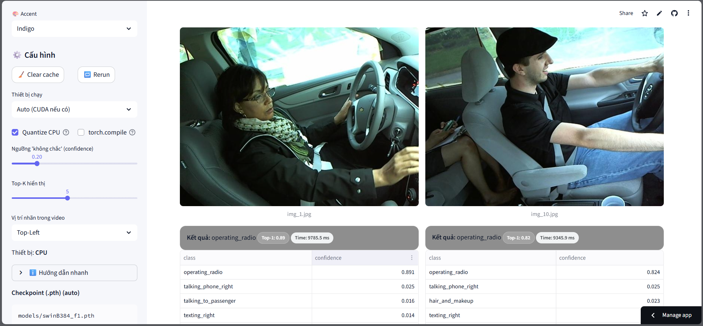
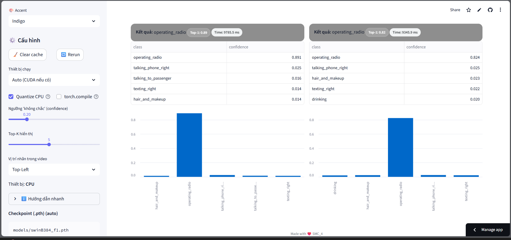

# BÁO CÁO SẢN PHẨM HACKATHON AI

## 1. Giới thiệu
- **Tên đội:** SMC_4  
- **Thành viên:**  
  - Đỗ Văn Tiến – CNTT4 – K65  
  - Nguyễn Duy Phước – DTVT1 – K64  
- **Đề tài:** Phát hiện hành vi lái xe mất tập trung qua ảnh & video  
- **Sự kiện:** Summer Code Camp

## 2. Vấn đề & Động lực
- Tai nạn giao thông do **tài xế mất tập trung** chiếm tỷ lệ lớn.  
- Cần hệ thống phát hiện sớm các hành vi nguy hiểm (nhắn tin, gọi điện, uống nước, …).  
- **Mục tiêu:** Xây dựng web cho phép người dùng tải ảnh/video → hệ thống phát hiện và **phân loại hành vi sao nhãng**.

## 3. Giải pháp của nhóm

### 3.1. Dữ liệu
- **Dataset:** *State Farm Distracted Driver Detection* (Kaggle).
- **10 lớp hành vi:**
  - `safe_driving` – lái xe an toàn  
  - `texting_right` – nhắn tin (tay phải)  
  - `talking_phone_right` – gọi điện (tay phải)  
  - `texting_left` – nhắn tin (tay trái)  
  - `talking_phone_left` – gọi điện (tay trái)  
  - `operating_radio` – điều chỉnh radio  
  - `drinking` – uống nước  
  - `reaching_behind` – với tay phía sau  
  - `hair_and_makeup` – chải tóc/trang điểm  
  - `talking_to_passenger` – nói chuyện với hành khách
- **Tiền xử lý & Augmentation:** RandAugment `rand-m9-mstd0.5-inc1`  
  - Độ mạnh *m* = 9 (dao động ±0.5), tăng theo bước 1 → đa dạng hoá dữ liệu, giảm overfitting.
- **Kích thước ảnh vào:** **384×384** (giữ nhất quán giữa train & infer).

### 3.2. Mô hình AI
- **Backbone:** **Swin Transformer B-384** (ViT-based).  
- **Huấn luyện:** fine-tune toàn bộ trên dataset; tối ưu hoá cho 10 lớp hành vi.  
- **Lý do chọn:** khả năng nắm bắt quan hệ không gian rộng, thường cho kết quả tốt trên bài toán phân loại hành vi (đặc biệt khi bối cảnh và tư thế đa dạng).

## 4. Triển khai & Demo (Streamlit)

### 4.1. Pipeline hệ thống
1. Người dùng upload ảnh/video trên web.  
2. Backend xử lý → gọi mô hình **Swin-B384** dự đoán.  
3. Trả về **nhãn hành vi & xác suất**; với video: xử lý *frame-by-frame* và **overlay nhãn**.

### 4.2. Giao diện người dùng
- Trang chính: **Realtime Classifier** (ảnh & video, GPU/CPU, quantize, top-K, biểu đồ).  
- Thông tin mô hình hiển thị: kiến trúc, input **384×384**, số lớp, thiết bị, trạng thái quantize, số tham số.

### 4.3. Cấu hình dành cho người dùng
- **Thiết bị:** CPU, GPU, hoặc **Auto** (CUDA nếu có).  
- **Quantize CPU:** bật/tắt để tăng tốc trên CPU.  
- **Confidence threshold:** lọc dự đoán “không chắc”.  
- **Top-K:** số nhãn hiển thị.  
- **Vị trí nhãn trong video:** top-left / top-right / bottom-left / bottom-right.  
> Các tuỳ chỉnh giúp người dùng cân bằng **tốc độ ↔ độ chính xác** theo nhu cầu demo.

### 4.4. Ảnh & 4.5. Video
- **Ảnh:** kéo-thả nhiều file (JPG/PNG) → trả nhãn + xác suất.  
- **Video:** hỗ trợ MP4/MOV/AVI/MKV (≤200 MB), có **FPS sampling** để kiểm soát tải tính toán.

### 4.6. Trải nghiệm người dùng
- Quy trình 3 bước: **mở web → upload → xem kết quả**.

**Ảnh minh họa sản phẩm:**  

*Hình 1: Dự đoán với chế độ Ảnh*

*Hình 2: Hiển thị trực quan dự đoán*

## 5. Đánh giá & Kết quả

### 5.1. Chỉ số trên tập validation
- **Accuracy:** **0.9345**  
- **F1-macro:** **0.9311**  
- **Nhầm lẫn chủ yếu:** các cặp hành vi tương tự (ví dụ: gọi điện trái/phải; nhắn tin trái/phải, …).

### 5.2. Hiệu năng & môi trường
- **GPU:** chạy gần realtime trong demo.  
- **CPU (Quantize ON):** tốc độ chậm hơn.  
- **Streamlit cache** giúp giảm thời gian tải mô hình.

### 5.3. Khả năng mở rộng
- Tích hợp camera gắn trên ô tô; đóng gói **Docker**; dự phòng **Edge AI** với model nhẹ.

## 6. Khó khăn & Bài học
- Độ chính xác giảm trên ảnh/video **chất lượng thấp** (mờ, thiếu sáng, góc chụp lệch).  
- **Giới hạn dung lượng video** khi upload; độ trễ khởi tạo mô hình.  
- **Bài học:** kết hợp mô hình mạnh (Swin) với cơ chế **quantize** và **sampling** để cân bằng trải nghiệm.

## 7. Hướng phát triển
- **Tối ưu realtime:** thử các backbone nhẹ (MobileNet / EfficientNet / ConvNeXt-Tiny), **knowledge distillation**, **batch-inference**.  
- **Mở rộng dữ liệu:** thu thập thêm bối cảnh Việt Nam; cân bằng lớp khó.  
- **Theo dõi & phân tích lỗi:** confusion matrix, ví dụ sai tiêu biểu để cải thiện.  
- **Bảo mật & đạo đức:** xử lý cục bộ/ẩn danh hoá khuôn mặt khi cần; lưu ý quyền riêng tư.

## 8. Kết luận
Nhóm đã phát triển thành công **web app phát hiện hành vi lái xe mất tập trung** bằng **Swin-B384** và **Streamlit**. Hệ thống đạt **Accuracy 93.45%**, **F1 93.11%** trên validation; hỗ trợ **ảnh & video**, có **tuỳ chỉnh người dùng** rõ ràng; vận hành **gần realtime trên GPU**. Sản phẩm chứng minh tính khả thi và có tiềm năng triển khai thực tế nhằm **nâng cao an toàn giao thông**.
